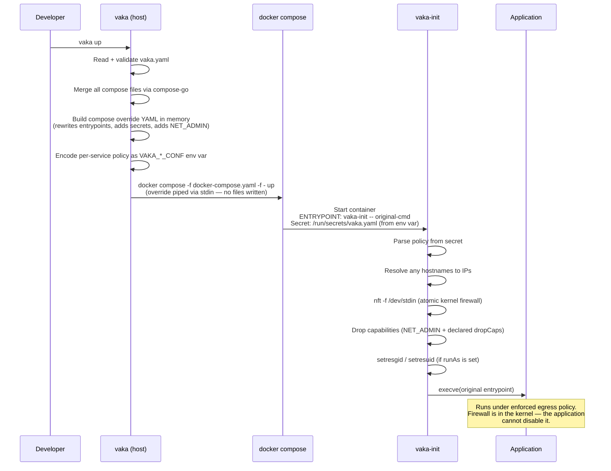

# vaka

Kernel-enforced egress firewall for Docker containers, applied at startup with no host-side artifacts.

`vaka` wraps `docker compose` and transparently injects an nftables egress policy into every container it starts — without modifying your `docker-compose.yaml`, without writing temp files to disk, and without changing the container image.

---

## Why vaka?

### The problem

Containers share the host's network stack by default. A running container can reach any IP address the host can reach — your internal services, cloud metadata endpoints, package registries, and the open internet. Most container runtimes provide coarse controls (network namespaces, published ports), but nothing that lets you say: *this specific service may only call these specific endpoints, and nothing else*.

`vaka` solves this with nftables: a kernel firewall applied inside the container's own network namespace, configured per-service, enforced before the application binary starts.

### Use cases

**AI agentic harnesses** — the primary motivation. Agentic AI systems run tools, write code, call APIs, and browse the web. Containing their network access to only the services they legitimately need limits blast radius when a model misbehaves, is prompted to exfiltrate data, or calls unexpected endpoints.

**Untrusted vendor software** — Third-party monitoring agents, analytics platforms, security tools, and SaaS connectors often have opaque network behaviour. Run them in a container with `vaka` to verify that "phone home" traffic goes exactly where the vendor claims.

**Build and CI environments** — A build agent that can reach your production secrets manager or internal APIs is a supply-chain risk. Restrict build containers to package registries and artifact stores only.

**Dev/staging isolation** — Prevent development containers from accidentally reaching production endpoints. A misconfigured environment variable should not be able to hit a live database.

**Regulatory compliance** — PCI-DSS, HIPAA, and SOC 2 require network segmentation. `vaka` provides auditable, declarative egress rules that map directly to compliance controls.

**Data processing pipelines** — Containers that ingest or transform sensitive data should be able to egress only to your data warehouse and logging endpoint. `vaka` makes that a one-line policy.

**Suspicious binary analysis** — Need to run an untrusted binary to see what it does? Run it with `vaka` pointing to a deny-all or allow-only-specific-IPs policy. The binary cannot establish any connection outside the allowlist.

**Third-party plugins and extensions** — Marketplace or partner code running in your infrastructure gets its own egress policy, no matter what libraries it bundles.

---

## How it works

### Overview

```
HOST                                    CONTAINER BOUNDARY
────────────────────────────────────    ──────────────────────────────────────────
                                        ┌──────────────────────────────────────┐
vaka.yaml          ┐                    │                                      │
docker-compose.yaml┘ ──► vaka up       │  vaka-init (PID 1)                   │
                              │         │  ┌──────────────────────────────┐    │
                              │ generates│  │ 1. parse /run/secrets/vaka.yaml│  │
                              │ override │  │ 2. resolve hostnames → IPs   │  │
                              │ in memory│  │ 3. nft -f /dev/stdin         │  │
                              │         │  │ 4. drop Linux capabilities   │  │
                              ▼         │  │ 5. setuid / setgid           │  │
                    docker compose      │  │ 6. execve(application)       │  │
                    -f docker-compose.yaml  └──────────────┬───────────────┘  │
                    -f -  ◄── (stdin)   │                  │                   │
                              │         │  Application (under egress firewall)  │
                              │ no temp │                                      │
                              │ files   └──────────────────────────────────────┘
                              │
                              └── policy delivered as Docker secret
                                  (base64 env var → tmpfs mount, never on disk)
```

### The injection flow



### No host-side artifacts

vaka never writes the policy to disk on the host. The flow is:

1. vaka serialises the per-service policy slice to YAML, base64-encodes it, and sets it as an environment variable (`VAKA_<SERVICE>_CONF`).
2. The compose override declares a Docker secret sourced from that environment variable.
3. Docker mounts the decoded content at `/run/secrets/vaka.yaml` inside the container — a kernel `tmpfs` mount, invisible to the host filesystem.
4. vaka-init reads the secret, applies the firewall, and then the secret's value is no longer needed.

The compose override YAML itself is piped to `docker compose` via stdin (the `-f -` flag). Nothing is written to `/tmp`, the working directory, or anywhere else.

### Inside the container: vaka-init

`vaka-init` is a static binary that runs as PID 1 (or as the container entrypoint) before the application. It executes seven steps in order:

| Step | Action | Fail behaviour |
|------|--------|----------------|
| 1 | Parse `/run/secrets/vaka.yaml` (strict — unknown fields are errors) | `fatal`, container exits |
| 2 | Resolve `dns: {}` rules and hostnames in `to:` lists to IP addresses | `fatal` |
| 3 | Apply nftables ruleset atomically via `nft -f /dev/stdin` | `fatal` |
| 4 | Drop capabilities listed in `dropCaps` | `fatal` |
| 5 | `setresgid` / `setresuid` if `runAs` is set | `fatal` |
| 6 | `execve` the original entrypoint | `fatal` |

`vaka-init` is fail-closed: any error at any step stops the container before the application ever starts. The application cannot run without a firewall.

### The nftables ruleset

vaka generates an `inet` family table (covers both IPv4 and IPv6) with an `output` hook chain. A minimal ruleset looks like this:

```nft
table inet vaka {
  chain egress {
    type filter hook output priority 0;
    policy accept;

    # implicit invariants
    ct state established,related accept
    oif "lo" accept

    # metadata endpoint block (when block_metadata: true)
    ip  daddr { 169.254.169.254 } drop
    ip6 daddr { fd00::ec2:254   } drop

    # explicit accept rules (from vaka.yaml)
    ip daddr { 93.184.216.34 } tcp dport { 443 } accept

    # default action
    reject
  }
}
```

Established connections are always accepted (no mid-session drops). Loopback is always allowed. Rules are applied in order: drop → reject → accept → default.

---

## Getting started

### Prerequisites

- Docker with Compose v2 (`docker compose version`)
- `nft` (nftables) must be available inside the container at `/usr/local/sbin/nft`
- The container must have `CAP_NET_ADMIN` at startup (vaka adds it automatically via the compose override)

### Install vaka-init in your image

**Option A — copy from the pre-built image (recommended)**

```dockerfile
FROM emsi/vaka-init:latest AS vaka

FROM ubuntu:24.04
# ... your image setup ...
COPY --from=vaka /opt/vaka/bin/vaka-init /usr/local/sbin/vaka-init
COPY --from=vaka /opt/vaka/bin/nft       /usr/local/sbin/nft
```

Both binaries are fully static. They run on any Linux base (Alpine, Ubuntu, Debian, Fedora, scratch).

**Option B — mount from the host at runtime**

If you cannot modify the image, bind-mount the binaries:

```yaml
# docker-compose.yaml
services:
  myapp:
    image: vendor/myapp:latest
    volumes:
      - /usr/local/sbin/vaka-init:/usr/local/sbin/vaka-init:ro
      - /usr/local/sbin/nft:/usr/local/sbin/nft:ro
```

Install the binaries on the host first:
```bash
docker run --rm emsi/vaka-init:latest  # inspect paths
# then copy out of the image:
id=$(docker create emsi/vaka-init:latest)
docker cp "$id:/opt/vaka/bin/vaka-init" /usr/local/sbin/vaka-init
docker cp "$id:/opt/vaka/bin/nft"       /usr/local/sbin/nft
docker rm "$id"
```

### Install the vaka CLI (host)

Build from source (see [Building from source](#building-from-source)) or download a release binary and place it on your `PATH`.

### Write a vaka.yaml

Create `vaka.yaml` alongside `docker-compose.yaml`:

```yaml
apiVersion: vaka.dev/v1alpha1
kind: ServicePolicy
services:
  llm-gateway:
    network:
      egress:
        defaultAction: reject
        block_metadata: true
        accept:
          - dns: {}                          # DNS on resolv.conf servers
          - proto: tcp
            to: [api.openai.com]
            ports: [443]
          - proto: tcp
            to: [api.anthropic.com]
            ports: [443]
    runtime:
      runAs:
        uid: 1000
        gid: 1000
```

### Run

```bash
vaka up           # instead of docker compose up
vaka up --build   # pass any docker compose flags through
vaka run llm-gateway bash   # injection path for run too
vaka logs -f      # passthrough — identical to docker compose logs -f
vaka down         # passthrough
```

`vaka` is a drop-in replacement for `docker compose`. Global flags (`-f`, `-p`, `--profile`) work identically:

```bash
vaka -f prod.yaml up --build -d
vaka --vaka-file policies/prod.yaml -f prod.yaml up
```

### Validate before deploying

```bash
vaka validate                               # checks vaka.yaml only
vaka validate --compose docker-compose.yaml # also cross-checks service names and network_mode
```

### Preview the nft ruleset for a service

```bash
vaka show llm-gateway
```

Prints the nft ruleset that would be applied inside the container (without DNS resolution — hostnames shown as comments).

---

## Configuration reference

### vaka.yaml structure

```yaml
apiVersion: vaka.dev/v1alpha1
kind: ServicePolicy
services:
  <service-name>:
    network:
      egress:
        defaultAction: reject    # accept | reject | drop  (default: reject)
        block_metadata: false    # block cloud metadata endpoint (169.254.169.254 / fd00::ec2:254)
        accept: [<rule>, ...]
        reject: [<rule>, ...]
        drop:   [<rule>, ...]
    runtime:
      dropCaps: [NET_RAW, SYS_ADMIN]   # additional capabilities to drop
      runAs:
        uid: 1000
        gid: 1000
```

`<service-name>` must match a service name in `docker-compose.yaml`.

### Rule types

**DNS shorthand** — allows UDP/TCP port 53 to the servers in `/etc/resolv.conf`:

```yaml
- dns: {}
```

Override the DNS servers (useful in scratch containers without `/etc/resolv.conf`):

```yaml
- dns:
    servers: [1.1.1.1, 8.8.8.8]
```

**Address + port rule** — allows/rejects/drops traffic to specific hosts and ports:

```yaml
- proto: tcp
  to:
    - api.example.com          # hostname (resolved at container start)
    - 10.0.0.0/8               # CIDR
    - 192.168.1.1              # literal IP
  ports:
    - 443
    - "8080-8090"              # port range
```

`proto` is required when `ports` are specified. Valid protocols: `tcp`, `udp`, `icmp`, `icmpv6`.

**Protocol-only rule** — matches all traffic of a given protocol regardless of destination:

```yaml
- proto: icmp
```

**ICMP type filter**:

```yaml
- proto: icmp
  type: echo-request    # or an integer: type: 8
```

Named ICMP types: `echo-request`, `echo-reply`, `destination-unreachable`, `time-exceeded`, `redirect`, `parameter-problem`, `timestamp-request`, `timestamp-reply`, and ICMPv6 types: `nd-neighbor-solicit`, `nd-neighbor-advert`, `nd-router-solicit`, `nd-router-advert`, `mld-listener-query`, `mld-listener-report`.

### defaultAction

| Value | Behaviour |
|-------|-----------|
| `reject` | Unmatched packets get a TCP RST or ICMP port-unreachable. The application sees a connection refused immediately. **(default)** |
| `drop` | Unmatched packets are silently discarded. The application times out. |
| `accept` | Unmatched packets are allowed. Use with `drop`/`reject` lists to block specific destinations. **Emits a warning.** |

### block_metadata

When `true`, drops all traffic to the cloud instance metadata endpoints:
- IPv4: `169.254.169.254` (AWS, GCP, Azure, DigitalOcean, …)
- IPv6: `fd00::ec2:254`

Recommended for any container that should not have access to cloud credentials via IMDS.

### runtime.dropCaps

Capabilities to drop after the firewall is applied. Short-form names (`NET_RAW`) and prefixed names (`CAP_NET_RAW`) are both accepted.

vaka automatically adds `NET_ADMIN` to `cap_add` in the compose override so nft can install the firewall, then (if `NET_ADMIN` is in `dropCaps`) drops it before execve-ing the application. To keep `NET_ADMIN` in the application: omit it from `dropCaps`.

### runtime.runAs

Switches UID and GID before execve. `setresgid` is called before `setresuid` (required by POSIX). The kernel automatically clears Effective and Permitted capabilities on the `0 → nonzero` UID transition.

---

## CLI reference

### `vaka up`

Validates `vaka.yaml`, generates a compose override in memory, and runs `docker compose up` with the override piped via stdin. All `docker compose up` flags are passed through.

```
vaka [--vaka-file vaka.yaml] up [compose-flags...]
```

### `vaka run`

Same injection path as `up` but for `docker compose run`.

```
vaka [--vaka-file vaka.yaml] run [compose-flags...] <service> [command...]
```

### `vaka validate`

Parses and validates `vaka.yaml`. Optionally cross-checks service names against `docker-compose.yaml` and enforces that no service uses `network_mode: host`.

```
vaka validate [-f vaka.yaml] [--compose docker-compose.yaml]
```

### `vaka show <service>`

Prints the nft ruleset that would be loaded inside the named service's container. Hostnames in `to:` lists appear as comments (`# hostname`) rather than being resolved.

```
vaka show [-f vaka.yaml] <service>
```

### Passthrough commands

Any subcommand not listed above (`logs`, `down`, `exec`, `build`, `pull`, `push`, `ps`, `restart`, `stop`, `start`, `attach`, …) is forwarded verbatim to `docker compose`:

```bash
vaka logs -f llm-gateway       # → docker compose logs -f llm-gateway
vaka exec llm-gateway bash     # → docker compose exec llm-gateway bash
vaka down --volumes            # → docker compose down --volumes
```

### Global flags

| Flag | Default | Description |
|------|---------|-------------|
| `--vaka-file` | `vaka.yaml` | Path to the vaka policy file |

All Docker Compose global flags (`-f`, `-p`, `--profile`, `--env-file`, `--project-directory`, `--context`, …) are passed through unchanged.

---

## Building from source

### Requirements

- Go 1.25+
- Docker (for building the `emsi/vaka-init` image)
- Linux (for `cmd/vaka-init` — the init binary has a `//go:build linux` constraint)

### Build the vaka CLI

```bash
go build -o vaka ./cmd/vaka
sudo mv vaka /usr/local/bin/vaka
```

### Build vaka-init

```bash
CGO_ENABLED=0 GOOS=linux go build -trimpath -ldflags="-s -w" -o vaka-init ./cmd/vaka-init
sudo mv vaka-init /usr/local/sbin/vaka-init
```

### Build the emsi/vaka-init Docker image

```bash
docker build -f docker/init/Dockerfile -t emsi/vaka-init:dev .
```

The multi-stage build:
1. Pulls `emsi/nft-static:1.1.6` for the static `nft` binary (see [emsi/nft-static](nft/README.md))
2. Builds `vaka-init` with `CGO_ENABLED=0` in `golang:1.25-alpine`
3. Produces a `scratch` final image containing exactly two binaries

### Run tests

```bash
go test ./...
```

---

## Security model

**What vaka enforces:**

- Egress firewall rules are loaded into the kernel nftables subsystem before the application binary starts. The application cannot bypass or modify them without `CAP_NET_ADMIN`.
- vaka drops `CAP_NET_ADMIN` (and any other declared caps) before execve-ing the application, so the application cannot modify its own firewall rules.
- Ingress is not touched — containers remain reachable on their published ports.

**What vaka does not enforce:**

- Ingress traffic (use Docker's network isolation for that).
- Traffic from other containers in the same compose project (they share a bridge network by default — use Docker network segmentation or service-specific firewall rules for container-to-container isolation).
- `network_mode: host` containers — vaka rejects these at validation time because the host network namespace cannot be safely isolated per-container.

**Threat model note:** vaka is designed to contain well-behaved but potentially over-reaching software (AI agents calling unexpected APIs, vendor tools phoning home). It is not designed to contain actively hostile root-level processes that might exploit kernel vulnerabilities to bypass nftables. For that threat model, use a separate network namespace at the hypervisor or host network layer.
