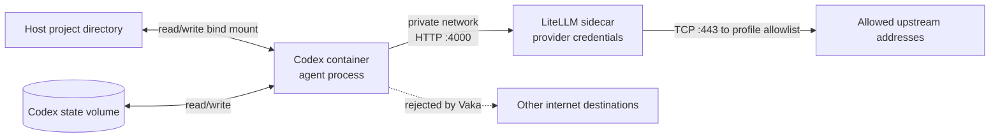

# Codex Recipe: A Restricted Agent Workspace

The published Codex recipe is a working Vaka example, not just a policy sample.
It gives Codex a project workspace and model access while removing direct,
general-purpose internet access from the agent container.

Follow [First Secure Codex Session](quickstart.md) to install and launch it. For
a real project, the normal entry point is:

```bash
cd /path/to/your/project
"$HOME/vaka-recipes/codex/myCodex"
```

## What Runs

The recipe starts two services:

- `codex` runs the coding agent with your current project mounted read/write.
- `litellm` holds the provider credentials and forwards approved model requests.



The LiteLLM port is exposed only on the private Compose network; it is not
published on the host.

## Everyday Commands

Run these from the project directory:

```bash
"$HOME/vaka-recipes/codex/myCodex"              # start if needed and attach
"$HOME/vaka-recipes/codex/myCodex" info         # resolved paths, image, and state
"$HOME/vaka-recipes/codex/myCodex" ps           # service status
"$HOME/vaka-recipes/codex/myCodex" exec bash    # shell inside Codex
"$HOME/vaka-recipes/codex/myCodex" restart      # restart the Codex service
"$HOME/vaka-recipes/codex/myCodex" down         # remove both containers
```

`down` keeps Codex configuration and history. `down -v` deletes that project's
state volume as well, so reserve it for an intentional reset.

## The Security Boundary

| Boundary | Codex container | LiteLLM sidecar |
| --- | --- | --- |
| Project files | Current project mounted read/write | Not mounted |
| Provider credential or ChatGPT token | Never supplied | Supplied for the selected profile |
| LiteLLM administrator key | Never supplied | Stored by the launcher; supplied only here |
| Outbound network | DNS and `litellm:4000` | DNS and TCP port 443 to addresses resolved from the profile allowlist |

Codex receives a fixed, non-secret gateway marker. LiteLLM accepts that marker
only on the inference, model, response, and hosted-search routes the agent needs;
management routes remain denied. A provider key, ChatGPT OAuth token, or LiteLLM
administrator key entering the Codex environment would be a security defect.

This is why the second container exists: Codex needs model access, but it does
not need the credential or a socket that can reach arbitrary websites. Vaka
allows the narrow Codex-to-LiteLLM connection and applies a separate upstream
allowlist to LiteLLM.

## Authentication Profiles

The first launch presents these choices:

| Profile | Authentication | Notes |
| --- | --- | --- |
| `chatgpt` | ChatGPT subscription device login | Default interactive choice; provider behavior can change. |
| `openai` | OpenAI API key | Key can come from a prompt, environment variable, or file. |
| `vertex` | Google service-account credentials | Experimental; verify it against your Vertex project. |

The successful selection is remembered under the recipe-managed `.secrets`
directory. Its restrictive file permissions protect against accidental exposure,
not another process running as your host user. Change profiles explicitly:

```bash
"$HOME/vaka-recipes/codex/myCodex" login chatgpt
"$HOME/vaka-recipes/codex/myCodex" login openai
"$HOME/vaka-recipes/codex/myCodex" auth status
```

If a project is already running under another profile, bring it down before
switching. The launcher refuses to silently reuse containers created with a
different credential and egress policy.

## Workspaces And State

Run `myCodex` from the project Codex should edit. The launcher mounts that
directory at the same absolute path inside the container and passes your host
UID and GID to the container entrypoint, which drops the agent process to that
identity. Files Codex creates therefore stay owned by you.

Codex home, configuration, and history live in a Docker volume named from the
project directory's basename. Removing the containers does not remove that
volume. Projects in different locations with the same basename therefore share
the default state name. Set `MYCODEX_SHARED_STATE=1` only when you intentionally
want all projects to share one Codex state volume.

Launching from the recipe directory is also supported. Instead of mounting the
credential-bearing recipe root, `myCodex` asks for a workspace name and uses a
directory below `.workspaces/`.

Extra `-v` or `--volume` options broaden what the agent can read and modify. A
custom `-f` or `--compose-file` can also add mounts or change the stack. Treat
either as an explicit expansion of the trust boundary.

## Update The Recipe

Stop an active project, update the same locked installation, then launch it
again:

```bash
cd /path/to/your/project
"$HOME/vaka-recipes/codex/myCodex" down
vaka get codex "$HOME/vaka-recipes/codex"
"$HOME/vaka-recipes/codex/myCodex"
```

`vaka get` updates recipe files but never changes running containers. Bringing
the stack down first ensures the next launch uses the new Compose files,
launcher, and policy while preserving the project's state volume.

## What This Protects

The boundary is useful against a prompt, repository instruction, or tool result
that tries to make Codex upload data directly to an arbitrary host. Those
connections are rejected inside the Codex container's network namespace.

It does not prevent:

- Codex from reading, changing, or deleting files inside the mounted project;
- Codex from including project content in permitted model or hosted-search
  requests sent through LiteLLM;
- unsafe code from harming the mounted project; or
- Docker, host, or kernel escape vulnerabilities.

Keep unrelated secrets outside the mounted project. Vaka limits network reach;
it is not a VM or a substitute for reviewing agent changes.

The LiteLLM image is digest-pinned. The cross-platform Codex workstation uses a
fixed version tag, so `vaka get` reports it as an unpinned-image risk. Review the
recipe and treat its registry and selected images as trusted inputs.

## Reuse The Pattern

When an agent needs another capability, prefer a narrow local sidecar—a package
cache, test database, documentation service, or browser gateway—over broadening
the agent's direct egress. Give the agent access only to that service, then give
the sidecar its own minimum upstream allowlist.

To apply that model to your own Compose services, start with
[Write Your First `vaka.yaml`](vaka-yaml-quickstart.md), then use the
[Policy Reference](policy.md) for the complete syntax.
