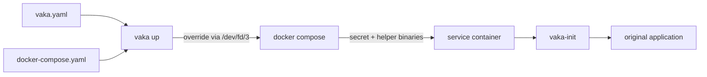

# How It Works

vaka combines your Compose file and `vaka.yaml` at runtime.

## Startup Flow



## Compose Override

For `up`, `run`, and `create`, vaka generates a Compose override in memory and streams it to `docker compose` through `/dev/fd/3`.

The override:

- adds or uses the `vaka-init` helper binaries,
- mounts the per-service policy as a Docker secret,
- runs `vaka-init` as the entrypoint,
- preserves the original entrypoint and command,
- adds the temporary capability needed to load nftables rules.

## Helper Injection

Normal mode creates a short-lived `__vaka-init` helper service from `emsi/vaka-init:<version>`. The helper exposes `/opt/vaka/sbin/vaka-init` and `/opt/vaka/sbin/nft` through a read-only shared volume mounted into policy-managed services.

Your application images are not modified.

Air-gapped mode skips this helper when binaries are already present in the image. Use:

```bash
vaka --vaka-init-present up
```

or the per-service Compose label:

```yaml
labels:
  agent.vaka.init: present
```

## Per-Service Policy Secret

vaka generates one policy document per managed service. The service-specific document includes generated runtime metadata, such as the original service user when available.

The policy is mounted inside the container at:

```text
/run/secrets/vaka.yaml
```

## `vaka-init` Startup Sequence

`vaka-init` runs before the application:

1. Parse `/run/secrets/vaka.yaml`.
2. Resolve `dns: {}` and hostnames using the container resolver.
3. Generate and load nftables rules atomically.
4. Resolve the target service user.
5. Apply optional `runtime.chown` actions.
6. Drop configured or auto-computed capabilities.
7. Switch to the original service user when configured.
8. `execve` the original application entrypoint.

If any step fails, the container exits before the application starts.

## Ruleset Shape

vaka creates an `inet` table and an `output` hook chain. The `inet` family covers IPv4 and IPv6.

Example shape:

```nft
table inet vaka {
  chain egress {
    type filter hook output priority 0;
    policy accept;

    ct state established,related accept
    oif "lo" accept

    ip  daddr 169.254.169.254/32 drop
    ip  daddr 100.100.100.200/32 drop
    ip6 daddr fd00:ec2::254/128 drop
    ip6 daddr fd20:ce::254/128 drop

    ip daddr { 93.184.216.34 } tcp dport { 443 } accept

    meta l4proto tcp reject with tcp reset
    reject with icmpx type admin-prohibited
  }
}
```

The chain policy is `accept`; the explicit terminal rule implements the configured default behavior. This lets vaka keep invariant and user rules readable while still enforcing the declared default.
