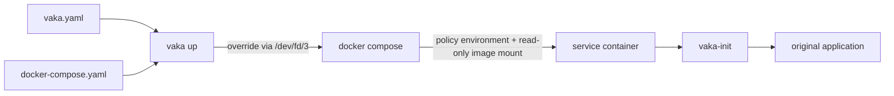

# How It Works

vaka combines your Compose file and `vaka.yaml` at runtime.

## Startup Flow


```mermaid
flowchart LR
    vf["vaka.yaml"] --> cli["vaka up"]
    cf["docker-compose.yaml"] --> cli
    cli -- "override via /dev/fd/3" --> dc["docker compose"]
    dc -- "policy environment + read-only image mount" --> c["service container"]
    c --> init["vaka-init"]
    init --> app["original application"]
```

## Compose Override

For `vaka compose up`, `run`, `create`, `scale`, and `watch`, Vaka generates a
Compose override in memory and streams it to `docker compose` through
`/dev/fd/3`. Unknown future Compose verbs fail closed until their execution
behavior is reviewed. `up` and `run` also have equivalent top-level
shorthands.

The override:

- mounts the exact resolved runtime image into each managed service,
- stores the per-service policy and its revision in the container configuration,
- pins the service to the exact image ID whose metadata Vaka inspected,
- runs `vaka-init` as the entrypoint,
- preserves the original entrypoint and command,
- adds the temporary capability needed to load nftables rules,
- labels the service with a semantic policy revision so Compose recreates it
  when its effective `vaka.yaml` policy changes.

## Runtime Injection

Normal mode locates `emsi/vaka-init:runtime-vX.Y.Z`, verifies its runtime-version
label, and resolves it to an immutable local `sha256:` image ID. The generated
Compose override mounts that local ID, never the mutable tag:

```yaml
volumes:
  - type: image
    source: sha256:<exact-local-image-id>
    target: /opt/vaka
    read_only: true
    image:
      subpath: opt/vaka
```

Docker Engine 29.0 and 29.1 need a special case: Vaka uses a 40-hex-character
prefix of the same ID to stay below those versions' filesystem-name limit.
Docker resolves the prefix only against its local image store and rejects an
ambiguous prefix. Vaka still retains the complete image ID in override metadata
and service labels. Engine 29.2 and newer fix the underlying issue. Compose 5.1
and newer expand image-volume sources back to full IDs, so Vaka rejects that
Compose version when it is paired with an affected Engine.

Both `/opt/vaka/sbin/vaka-init` and `/opt/vaka/sbin/nft` are mode `0555` in the
runtime image. A read-only image mount preserves their execute bits; it does not
make non-executable files executable. There is no helper container or helper
volume in the normal path.

Your application images are not modified. Managed services always use this
verified read-only runtime mount. Baked helper modes are rejected because a
root workload could replace a helper in its writable container layer before a
later healthcheck or `vaka exec` starts it with Vaka's temporary startup
privileges. Air-gapped installations should preload the runtime image into the
selected Docker target.

## Per-Service Policy

vaka generates one policy document per managed service. The service-specific document includes generated runtime metadata, such as the original service user when available.

The generated document records `generatedBy` for diagnostics and an exact
`requiredRuntimeVersion` for fail-closed compatibility. The service's
`agent.vaka.policy-revision` label hashes the effective semantic policy but
excludes `generatedBy`, so a host-CLI-only upgrade does not restart services.

The base64-encoded document and its revision are stored in reserved environment
variables in the immutable container configuration. Startup, healthchecks, and
managed execs inherit the same values; `vaka-init` recomputes and verifies the
revision before using the policy. Managed `run` and `exec` reject overrides of
these reserved variables.

## `vaka-init` Startup Sequence

`vaka-init` runs before the application:

1. Parse and verify the policy inherited from the container configuration.
2. Resolve `dns: {}` and hostnames using the container resolver.
3. Generate and load nftables rules atomically.
4. Resolve the target service user.
5. Apply optional `runtime.chown` actions.
6. Drop configured or auto-computed capabilities.
7. Switch to the original service user when configured.
8. `execve` the original application entrypoint.

If any step fails, the container exits before the application starts.

## Later Exec And Healthcheck Sequence

Docker creates exec and healthcheck processes from the stored container user
and capability configuration; they are not descendants of the application and
cannot inherit the capability drop performed by startup `vaka-init`. Managed
execs and healthchecks therefore use the immutable runtime trampoline. It
validates the injected policy and runtime, requires the kernel `inet vaka` table
to exist, drops policy capabilities from every capability set and verifies the
postcondition, switches to the service's effective Compose/image user or
explicit `exec --user` identity, and
then starts the command. Managed exec addresses the inspected container ID
directly; concurrent replacement cannot redirect it to another replica.

This readiness check closes the startup race but is not a complete ruleset
audit. Exec mode does not reload policy or repeat `runtime.chown`. Direct Docker
exec/API access remains outside Vaka's enforcement boundary.

## Upgrade From Legacy Helper Volumes

Older Vaka releases used a `__vaka-init` container and an anonymous
`/opt/vaka` volume. Before any full-render Compose command, Vaka detects that
exact legacy Compose service and records its Docker-labeled anonymous volume.
After Compose has moved services to image mounts, Vaka removes the old helper
and volume only when no non-helper container still references it.

Partial service upgrades are safe: the volume remains until the final legacy
consumer is recreated. `vaka down` captures the legacy volume before Compose
removes the containers and then removes the unused volume. Cleanup never uses
force, never removes named volumes, and revalidates Docker's anonymous-volume
marker immediately before deletion.

When that exact legacy state is present, Vaka sets
`COMPOSE_IGNORE_ORPHANS=true` for the migration's Compose subprocess so Compose
does not compete with Vaka for the historical `__vaka-init` helper. This also
means `--remove-orphans` does not remove unrelated project orphans during that
one invocation. After migration removes the helper, a subsequent command no
longer sets the variable and normal orphan handling resumes.

## Ruleset Shape

vaka creates an `inet` table and an `output` hook chain. The `inet` family covers IPv4 and IPv6.

Example shape:

```nft
table inet vaka {
  chain egress {
    type filter hook output priority 0;
    policy accept;

    ct state established,related accept
    oif "lo" accept

    ip  daddr 169.254.169.254/32 drop
    ip  daddr 100.100.100.200/32 drop
    ip6 daddr fd00:ec2::254/128 drop
    ip6 daddr fd20:ce::254/128 drop

    ip daddr { 93.184.216.34 } tcp dport { 443 } accept

    meta l4proto tcp reject with tcp reset
    reject with icmpx type admin-prohibited
  }
}
```

The chain policy is `accept`; the explicit terminal rule implements the configured default behavior. This lets vaka keep invariant and user rules readable while still enforcing the declared default.
