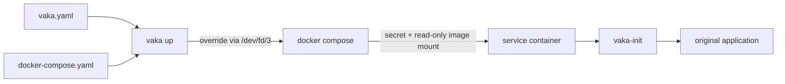

# How It Works

vaka combines your Compose file and `vaka.yaml` at runtime.

## Startup Flow


```mermaid
flowchart LR
    vf["vaka.yaml"] --> cli["vaka up"]
    cf["docker-compose.yaml"] --> cli
    cli -- "override via /dev/fd/3" --> dc["docker compose"]
    dc -- "secret + read-only image mount" --> c["service container"]
    c --> init["vaka-init"]
    init --> app["original application"]
```

## Compose Override

For `vaka compose up`, `run`, `create`, `scale`, and `watch`, Vaka generates a
Compose override in memory and streams it to `docker compose` through
`/dev/fd/3`. Unknown future Compose verbs use this full path until explicitly
classified as non-creating. `up` and `run` also have equivalent top-level
shorthands.

The override:

- mounts the exact resolved runtime image into each managed service,
- mounts the per-service policy as a Docker secret,
- runs `vaka-init` as the entrypoint,
- preserves the original entrypoint and command,
- adds the temporary capability needed to load nftables rules,
- labels the service with a semantic policy revision so Compose recreates it
  when its effective `vaka.yaml` policy changes.

## Runtime Injection

Normal mode locates `emsi/vaka-init:runtime-vX.Y.Z`, verifies its runtime-version
label, and resolves it to an immutable local `sha256:` image ID. The generated
Compose override mounts the image ID, not the tag, using an image mount:

```yaml
volumes:
  - type: image
    source: sha256:<exact-local-image-id>
    target: /opt/vaka
    read_only: true
    image:
      subpath: opt/vaka
```

Both `/opt/vaka/sbin/vaka-init` and `/opt/vaka/sbin/nft` are mode `0555` in the
runtime image. A read-only image mount preserves their execute bits; it does not
make non-executable files executable. There is no helper container or helper
volume in the normal path.

Your application images are not modified.

Air-gapped mode skips the image mount when binaries are already present in the service image. Use:

```bash
vaka --vaka-init-present up
```

or the per-service Compose label:

```yaml
labels:
  agent.vaka.init: present
```

## Per-Service Policy Secret

vaka generates one policy document per managed service. The service-specific document includes generated runtime metadata, such as the original service user when available.

The generated document records `generatedBy` for diagnostics and an exact
`requiredRuntimeVersion` for fail-closed compatibility. The service's
`agent.vaka.policy-revision` label hashes the effective semantic policy but
excludes `generatedBy`, so a host-CLI-only upgrade does not restart services.

The policy is mounted inside the container at:

```text
/run/secrets/vaka.yaml
```

## `vaka-init` Startup Sequence

`vaka-init` runs before the application:

1. Parse `/run/secrets/vaka.yaml`.
2. Resolve `dns: {}` and hostnames using the container resolver.
3. Generate and load nftables rules atomically.
4. Resolve the target service user.
5. Apply optional `runtime.chown` actions.
6. Drop configured or auto-computed capabilities.
7. Switch to the original service user when configured.
8. `execve` the original application entrypoint.

If any step fails, the container exits before the application starts.

## Upgrade From Legacy Helper Volumes

Older Vaka releases used a `__vaka-init` container and an anonymous
`/opt/vaka` volume. Before any full-render Compose command, Vaka detects that
exact legacy Compose service and records its Docker-labeled anonymous volume.
After Compose has moved services to image mounts, Vaka removes the old helper
and volume only when no non-helper container still references it.

Partial service upgrades are safe: the volume remains until the final legacy
consumer is recreated. `vaka down` captures the legacy volume before Compose
removes the containers and then removes the unused volume. Cleanup never uses
force, never removes named volumes, and revalidates Docker's anonymous-volume
marker immediately before deletion.

## Ruleset Shape

vaka creates an `inet` table and an `output` hook chain. The `inet` family covers IPv4 and IPv6.

Example shape:

```nft
table inet vaka {
  chain egress {
    type filter hook output priority 0;
    policy accept;

    ct state established,related accept
    oif "lo" accept

    ip  daddr 169.254.169.254/32 drop
    ip  daddr 100.100.100.200/32 drop
    ip6 daddr fd00:ec2::254/128 drop
    ip6 daddr fd20:ce::254/128 drop

    ip daddr { 93.184.216.34 } tcp dport { 443 } accept

    meta l4proto tcp reject with tcp reset
    reject with icmpx type admin-prohibited
  }
}
```

The chain policy is `accept`; the explicit terminal rule implements the configured default behavior. This lets vaka keep invariant and user rules readable while still enforcing the declared default.
